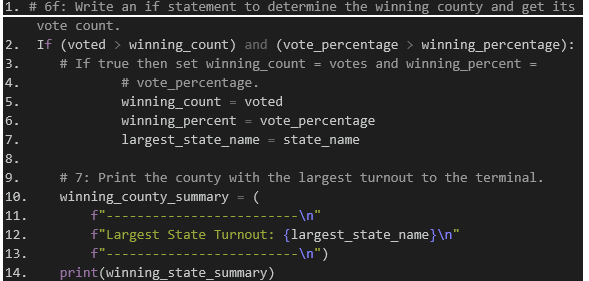
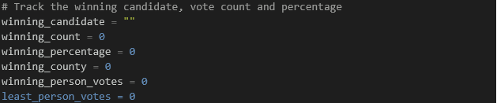

# Election Results Analysis
 

## Overview of Election Audit:
Colorado just completed an election in a U.S congressional precinct. Like every election the results must be certified. In the past, the process of certification was completed by using excel formulas to calculate the results. This year, our goal was to complete the certification by doing an audit using python. This automated process would be a much more efficient way in certifying the winner, and to separate data which will be useful to the public. 
If our code is successful, we will be able to see results such as the total number of votes for each county, the largest votes count by county, as well as each candidate vote count and even the percentage of votes for each individual candidate.  Our code will become the standard for future audits in the precent and perhaps in local election races. 

The Election results showed that there were 369,711 total votes.
As we can see by the results below, each county is represented by the total amount of votes and the percentage of voters that voted.
County Votes:
•	Jefferson: 10.5% (38,855)
•	Denver: 82.8% (306,055)
•	Arapahoe: 6.7% (24,801)

Largest County Turnout: 
Denver county received the largest percentage voted (82 %.8) which represented 306,055 of votes casted.

The candidates were:
1.	Charles Casper Stockham: 
2.	Diana DeGetta:
3.	Raymon Anthony Doane:
The Candidates results were:
•	Candidate 1, received 23% of the votes at 85,213 votes
•	Candidate 2, received 73.8% of the votes at 272,892 votes
•	Candidate 3 received 3.1% of the votes at 11,606 votes.
The Winner of the votes were Diana DeGretta, who received 73% of the votes and 272,892 number of votes.

Audit Summary:
 We were able to complete our audit of the congressional election with successful outcomes. Our code was able to quickly cipher through the data and allow us to provide a clear and true outcome of the elections. We believe our code can be used for any election in the future with simple modifications. 
For example, if we modified our code as shown in the example below, we could have it calculate the winning count for Largest State Turnout in a general election. 

2. A second proposed option would be to see which candidate received the least votes:

As you can see, with our code there is more efficiency, and it allows more automated options than using the excel standard that was used previously. 

